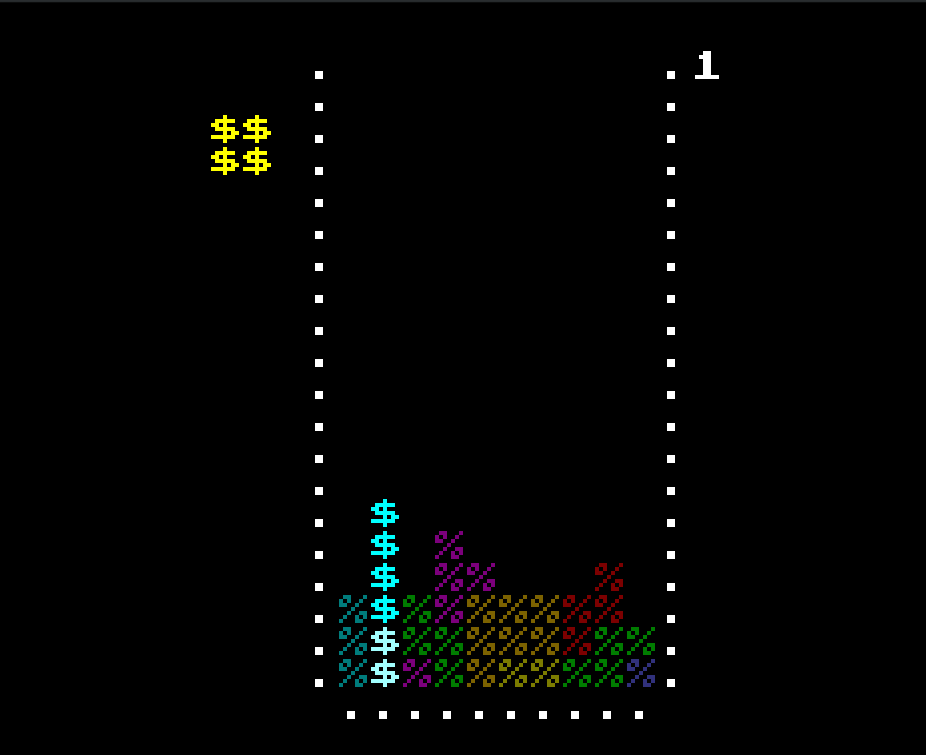

# java-projects
A collection of games, visualizers, demos, and algorythms written to learn java, and have fun

# Handy commands
A few quick commands to help running a project (not a full tutorial)
First, you must compile:
javac -d bin src/*.java

Then, run:
java -cp bin/ Driver
(Most of these will have a main class named after the specific project, or something like 'Driver' or 'Game', tab to look for them)
